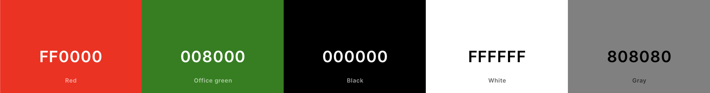
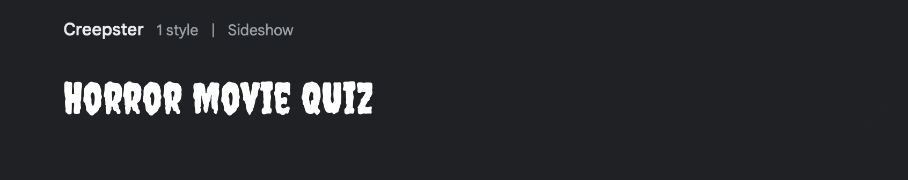

# Portfolio Project 2 - Horror Movie Quiz

Welcome to the Horror Movie Quiz, where you can test your knowledge of the scariest films in cinema. This quiz is designed to challenge your expertise in the horror genre and provide a thrilling experience for all horror movie enthusiasts. Also in this project is to show my skills and knowledge in Javascript.

---

## Live Site

- [Horror-Movie-Quiz] (https://miguelmurillog.github.io/horror-movie-quiz/)

## GITHUB Repository

- [Horror-Movie-Quiz] (https://github.com/MiguelMurilloG/horror-movie-quiz)

---

## User Experience (UX)

Client Goals:

- Provide an online quiz that is fun and easy to play.
- Offer a difficult yet enjoyable quiz format.
- Display final scores and the end of the quiz.
- Let them know the progress as the play.
- Give them a chance to play again and beat the score.

Visitot Goals:

- Test their knowledge of horror in a fun way.
- Enjoy a visually apppealing and user-friendly quiz interface.
- Receive and instant feedback on their quiz performance.

# Features 

- Entrance Page: Welcomes players with a spooky background image and a prominent quiz title.
- Quiz Area: Displays quiz questions and multiple-choice options within a container adorned with horror-themed visuals.
- Question Counter: Indicates the player's progress through the quiz, ensuring they know how many questions remain.
- Feedback: Provides immediate feedback on the player's answers, highlighting correct and incorrect choices.
- Results Page: Congratulates players on completing the quiz and reveals their final score.
- Play Again Option: Allows players to replay the quiz to beat their previous score and continue the fun.

### Design

### Colour Scheme

The colour schme is inspired by classic horror movies:

- Red: #FF0000
- Black: ##00000
- Grey: #808080
- White: #FFFFF
- Green: #008000

### Typography

The fonts used in this quiz were selected from Google Fonts, a library of open-source fonts that offers a wide range of styles for various design needs. Two distinct fonts were chosen to complement the theme and enhance readability:

- Heading Font: The heading font, "Creepster", was chosen for its modern and unique style, adding a touch of playfulness and intrigue to the overall design.
- Body Font: For the body text, a traditional serif font was selected to provide a sharp contrast to the heading font. The serif font ensures easy readability, making it ideal for presenting questions and other content in the quiz.
By combining these fonts, the quiz achieves a harmonious balance between creativity and legibility, enhancing the overall user experience.

### Tecnologies Used

- [HTML](https://www.w3schools.com/html/default.asp): Employed for crafting the fundamental site structure and content.
- [CSS](https://www.w3schools.com/css/default.asp): Utilized for embellishing and refining the aesthetic aspects and layout of the main site.
- [CSS-Flexbox](https://www.w3schools.com/css/css3_flexbox.asp): Implemented for enhancing the responsiveness and adaptability of the design.
- [Git](https://git-scm.com): Employed for version control management, including essential commands such as git add, git commit, and git push.
- [GitHub]: Utilized as a reliable platform for secure storage and collaborative development of the codebase.
- [GitHub-Pages](https://pages.github.com): Deployed to host the finalized front-end site, ensuring its accessibility to a wider audience.
- [Gitpod](https://gitpod.io/workspaces): Utilized as a cloud-based Integrated Development Environment (IDE) for seamless and efficient coding workflows.