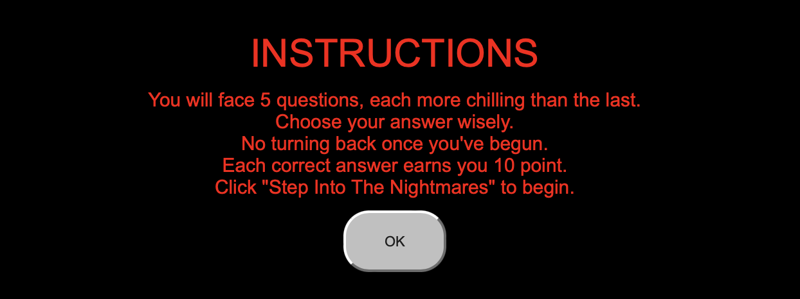
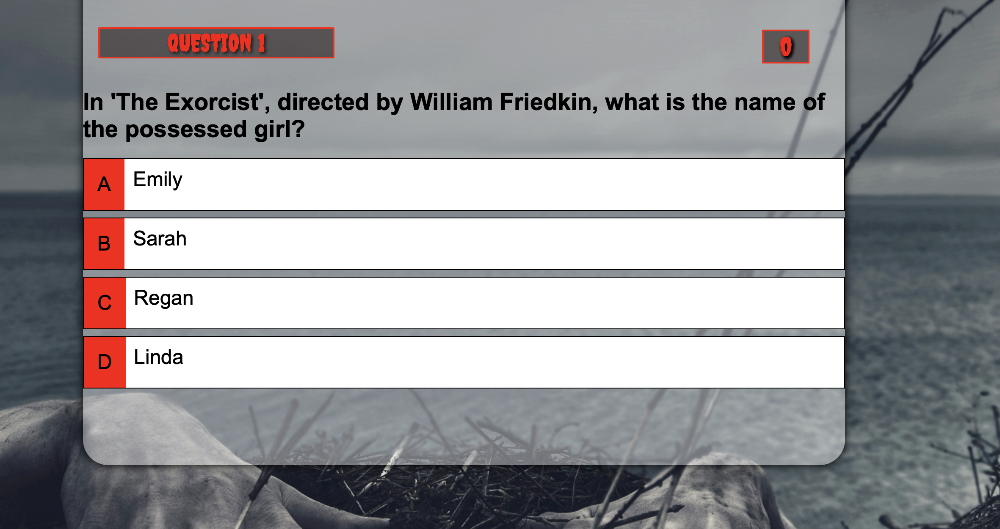
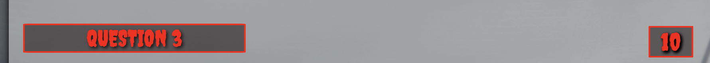
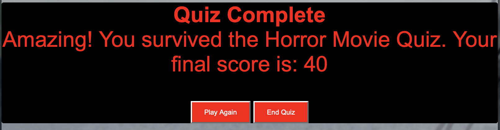

# Portfolio Project 2 - Horror Movie Quiz

Welcome to the Horror Movie Quiz, where you can test your knowledge of the scariest films in cinema. This quiz is designed to challenge your expertise in the horror genre and provide a thrilling experience for all horror movie enthusiasts. Also in this project is to show my skills and knowledge in Javascript.

---

## Live Site

- [You can view the live site here](https://miguelmurillog.github.io/horror-movie-quiz/)

## Github Repository

- [You can view the Github page here](https://github.com/MiguelMurilloG/horror-movie-quiz)

---

## User Experience (UX)

Client Goals:

- Provide an online quiz that is fun and easy to play.
- Offer a difficult yet enjoyable quiz format.
- Display final scores and the end of the quiz.
- Let them know the progress as the play.
- Give them a chance to play again and beat the score.

Visitor Goals:

- Test their knowledge of horror in a fun way.
- Enjoy a visually apppealing and user-friendly quiz interface.
- Receive and instant feedback on their quiz performance.

### Design

### Colour Scheme

The colour schme is inspired by classic horror movies:

- Red: #FF0000
- Black: ##00000
- Grey: #808080
- White: #FFFFF
- Green: #008000

### Background Image
- Dynamic Backgrounds: I used two different background images are used throughout the quiz experience to create a distinct atmosphere. The main page features a chilling entrance background, while the quiz game area showcases a different background, enhancing immersion and visual appeal.

### Typography

The fonts used in this quiz were selected from Google Fonts, a library of open-source fonts that offers a wide range of styles for various design needs. Two distinct fonts were chosen to complement the theme and enhance readability:

- Heading Font: The heading font, "Creepster", was chosen for its modern and unique style, adding a touch of playfulness and intrigue to the overall design.
- Body Font: For the body text, a traditional serif font was selected to provide a sharp contrast to the heading font. The serif font ensures easy readability, making it ideal for presenting questions and other content in the quiz.
By combining these fonts, the quiz achieves a harmonious balance between creativity and legibility, enhancing the overall user experience.

## Features 

 ### Main Page
- Welcomes players with a chilling atmosphere created by a spooky background image and a prominently displayed quiz title, setting the tone for the eerie experience to come.

### Instructions 
- Detailed and clear instructions guide players on how to navigate the quiz, ensuring they understand the mechanics before delving into the questions. The instructions provide essential information, such as how many questions they will face and how scoring works.

### Quiz Area
- Immerse yourself in the dark world of horror with the quiz area, which displays each question alongside multiple-choice options. The container is adorned with horror-themed visuals, enhancing the atmosphere and adding to the suspense of the game.

### Question Counter
- Keep track of your progress through the quiz with the question counter, prominently displayed to ensure players know how many questions remain. This feature adds to the suspense and excitement as players strive to reach the end of the quiz.

### Feedback
- Receive immediate feedback on your answers as the quiz progresses. Correct answers are highlighted, providing a sense of accomplishment, while incorrect choices are flagged to help players learn and improve their knowledge.

### Score Area
Experience a thrilling conclusion to the quiz as the results page congratulates players on completing the challenge and reveals their final score. This page serves as a satisfying conclusion to the game, offering closure and a sense of achievement.

### Play Again Option
- Keep the horror alive with the play again option, allowing players to replay the quiz and strive to beat their previous score. This feature encourages replayability and ensures endless entertainment for horror enthusiasts.

### End Quiz Option
- Players have the option to end the quiz at any time, allowing them to exit the game and view their final score. 

### Tecnologies Used

- [HTML](https://www.w3schools.com/html/default.asp): Employed for crafting the fundamental site structure and content.
- [CSS](https://www.w3schools.com/css/default.asp): Utilized for embellishing and refining the aesthetic aspects and layout of the main site.
- [CSS Flexbox](https://www.w3schools.com/css/css3_flexbox.asp): Implemented for enhancing the responsiveness and adaptability of the design.
- [Git](https://git-scm.com): Employed for version control management, including essential commands such as git add, git commit, and git push.
- [GitHub](https://github.com): Utilized as a reliable platform for secure storage and collaborative development of the codebase.
- [GitHub Pages](https://pages.github.com): Deployed to host the finalized front-end site, ensuring its accessibility to a wider audience.
- [Gitpod](https://gitpod.io/workspaces): Utilized as a cloud-based Integrated Development Environment (IDE) for seamless and efficient coding workflows.

---
### Deployment

The site was deployed to GitHub pages. The steps to deploy are:

- In the GitHub repository, navigate to the Settings tab.
- On the GitHub Pages section clicked on the pages settings dedicated tab link.
- From the source section drop-down menu, select the Main Branch click on seve.
- Once the Main Branch has been selected and saved, the page provided the link to the completed website.

- The live link can be found here: [Horror Movie Quiz](https://miguelmurillog.github.io/horror-movie-quiz/)

## Local Development

### How to Fork

To fork a repository on GitHub, follow these steps:

- Log in to GitHub or create a new account.
- Find the repository for the horror movie quiz project.
- Click the "Fork" button in the top right corner, located below where "Settings" is displayed.
- By forking the repository, you create a copy of the original project under your GitHub account, allowing you to make changes and contribute to the project without affecting the original repository.

### How to Clone

To clone a repository on Github, follow these steps:

- Log in to Github - or step up a new account.
- Find the repository for [Horror Movie Quiz](https://github.com/MiguelMurilloG/horror-movie-quiz) (the repository for the quiz is called 'horror-movie-quiz').
- Click on the code button, select whether you would like to clone with HTTPS, SSH or GitHub CLI and copy the link shown.
- Open the terminal in your code editor and change the current working directory to the location you want to use for the cloned directory.
- Type 'git clone' into the terminal and paste the link you copied in step 3. Press enter.

## Credits
- [Udemy](https://www.udemy.com/course/build-a-quiz-app-with-html-css-and-javascript/learn/lecture/13685348#content): The foundational concepts and structure of the quiz were derived from this course, providing a solid framework for further customization and enhancement.
- [W3Schools](https://www.w3schools.com):  Offered valuable resources and tutorials on HTML, CSS, and JavaScript concepts.
- [Slack Community](https://slack.com/intl/en-gb/): A helpful community for troubleshooting and solving coding challenges.

## Acknowledgements
I want to express my gratitude to the following individuals and communities for their contributions and support during the development of this horror movie quiz:

- Sheryl Goldberg: My mentor from Code Institute, whose insightful feedback and guidance helped shape this project into what it is today.
- Code Institute Tutor Team: Their assistance with troubleshooting and advice on coding challenges have been invaluable throughout the development process.
- Code Institute Slack Community: The supportive environment and shared knowledge within the community were instrumental in overcoming obstacles and staying motivated.
- My Family and Friends: Special thanks to my loved ones for their encouragement, patience, and willingness to test the quiz repeatedly.
- Unsplash: Thank you to the photographers on Unsplash for providing stunning imagery that helped set the eerie atmosphere of the quiz.
- Google Fonts: The selection of fonts from Google Fonts added personality and style to the quiz interface.
- GitHub and Gitpod: Utilizing version control with Git and hosting the project on GitHub and Gitpod made collaboration and development seamless.