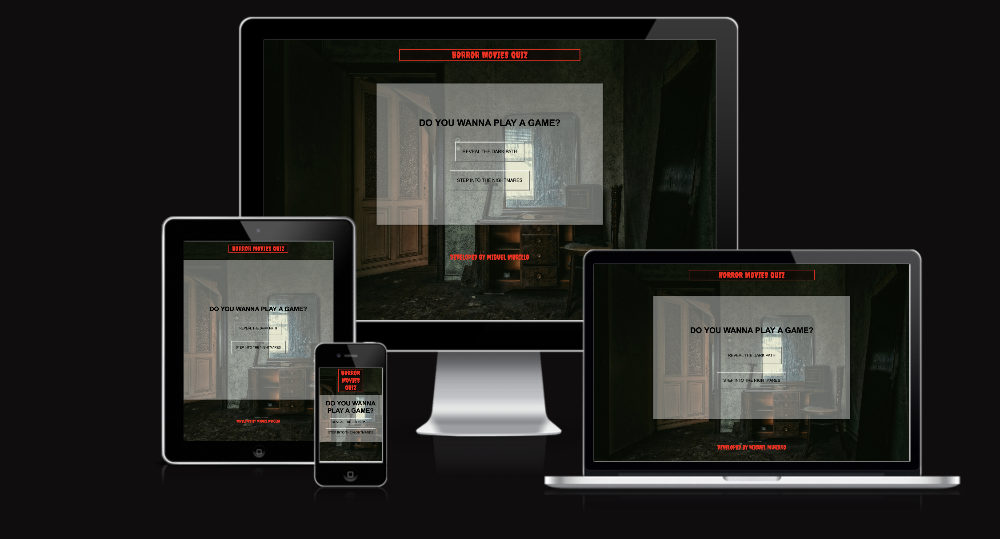
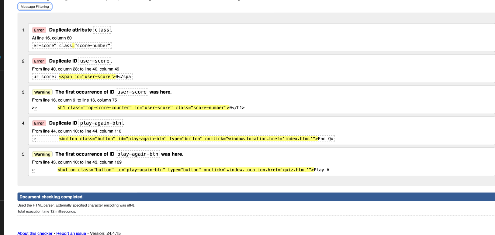
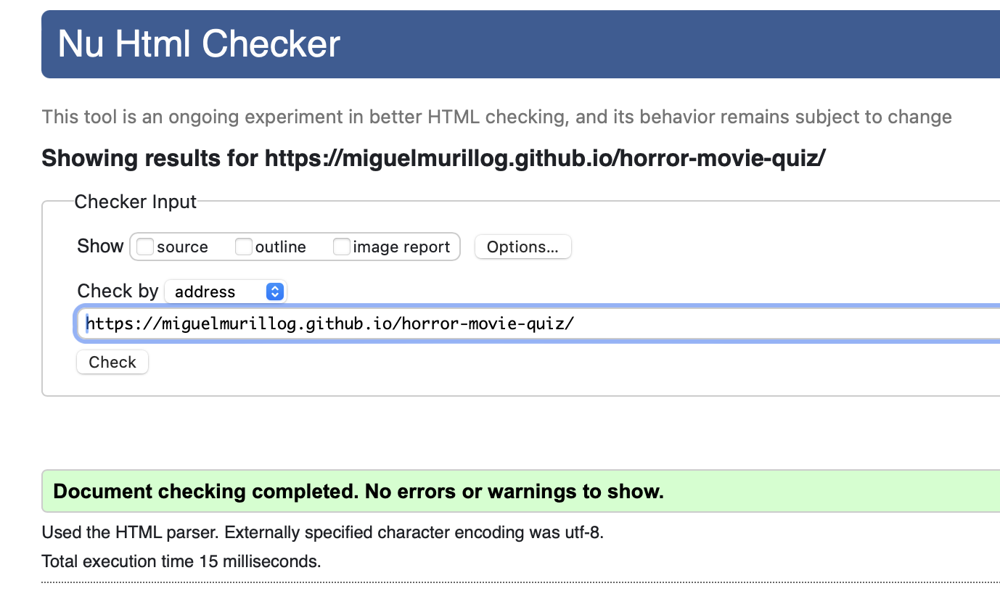
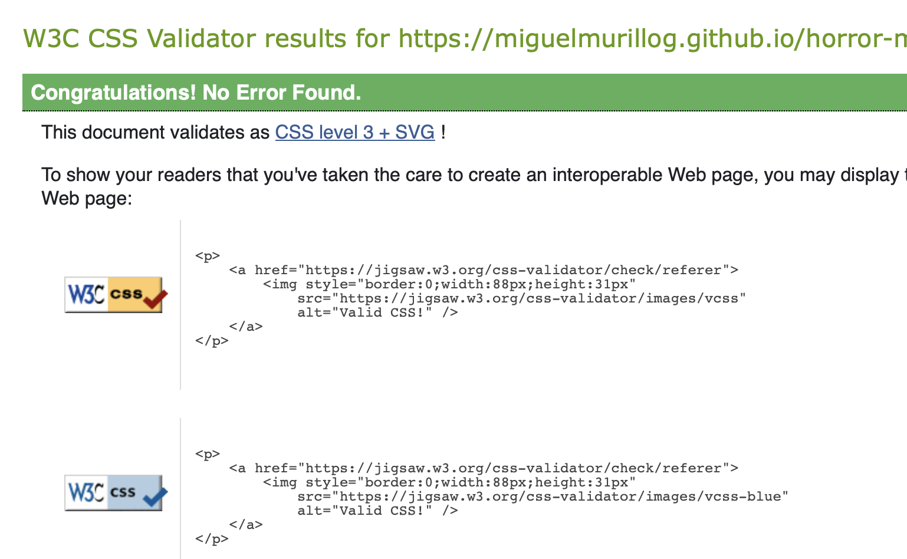
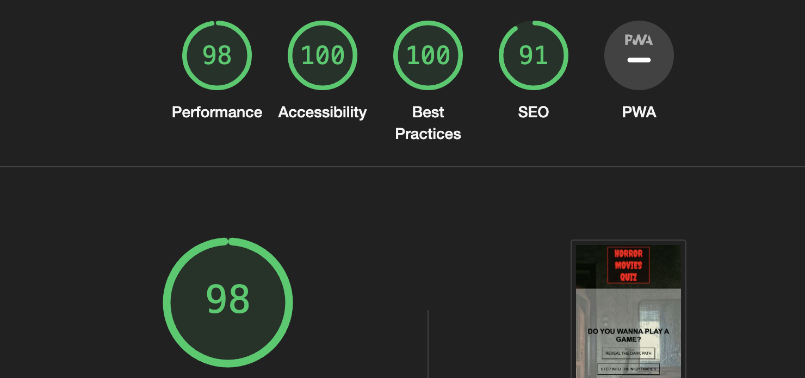
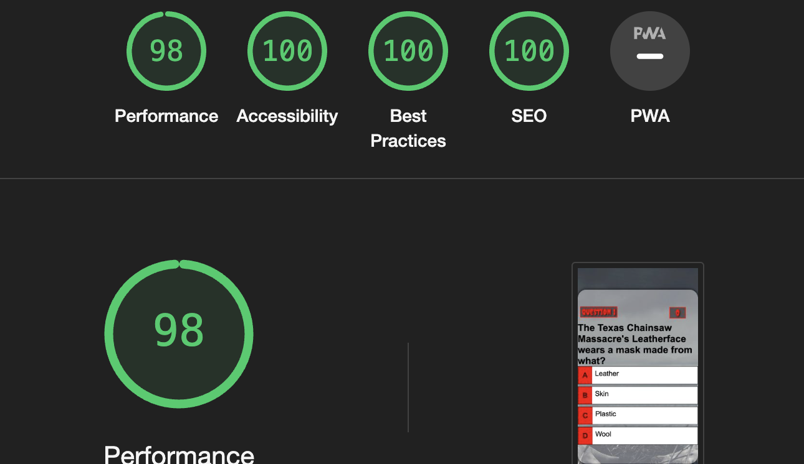
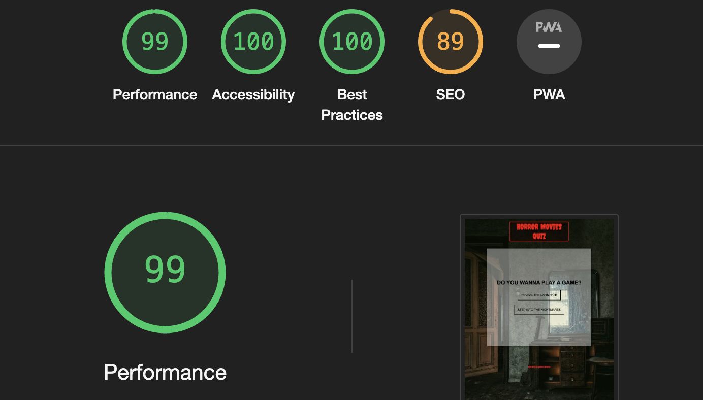
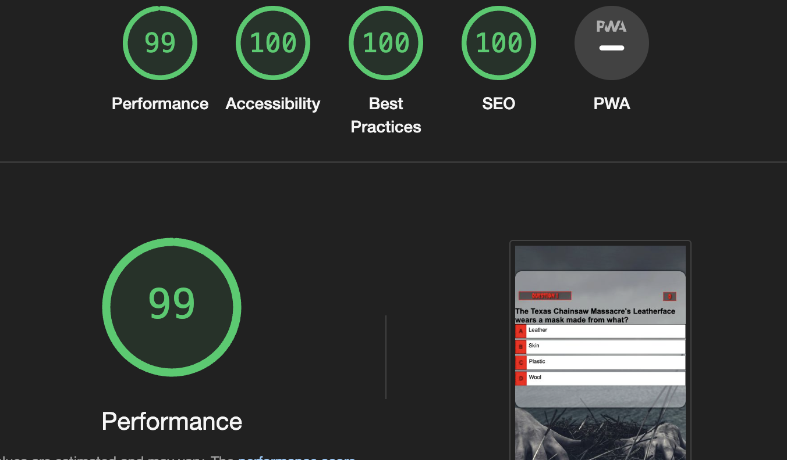

# HORROR MOVIE QUIZ - TESTING 

## Code Validation

### W3C Validator HTML and CSS

[W3C](https://validator.w3.org) 

### HMTL
- Some errors were returned when passing through the W3C HTML

- After making changes to the HTML code, rerun the validation process using the W3C HTML validator to ensure that the errors have been addressed successfully. I repeat this process until the HTML code passes validation without any errors.

### CSS

- No errors were returned when passing thourgh the W3C CSS

## Lighthouse

- During the development process, I utilized Lighthouse within Chrome Developer Tools to conduct comprehensive assessments of the website's performance, accessibility, adherence to best practices, and search engine optimization (SEO) aspects.

### Mobile Results

### Desktop Results

## Manual Testing 

- During the development of my project, I was using Google DevTools for resolve bugs.

### question.js
- Fixed a syntax error by adding a come after a closes square bracket on the starQuiz

### Question Counter
-Resolved the issue with the question counter by addding questionCcounter + 1, to update the counter
dinamically, enabling proper tracking of the question progression

### Play Again Button
- Addressed the malfunctioning 'Play Again' button by implementing a click event listener, ensuring users can restart the quiz seamlessly for an enhanced user experience.

### Meta Tags
- I have to add meta tags to improve my SEO

## General Testing Summary

- The site is been testing by friends and Slack Community.
- No reported issues or bugs, indicating smooth funcionality.

Back to [READ.md](README.md)
